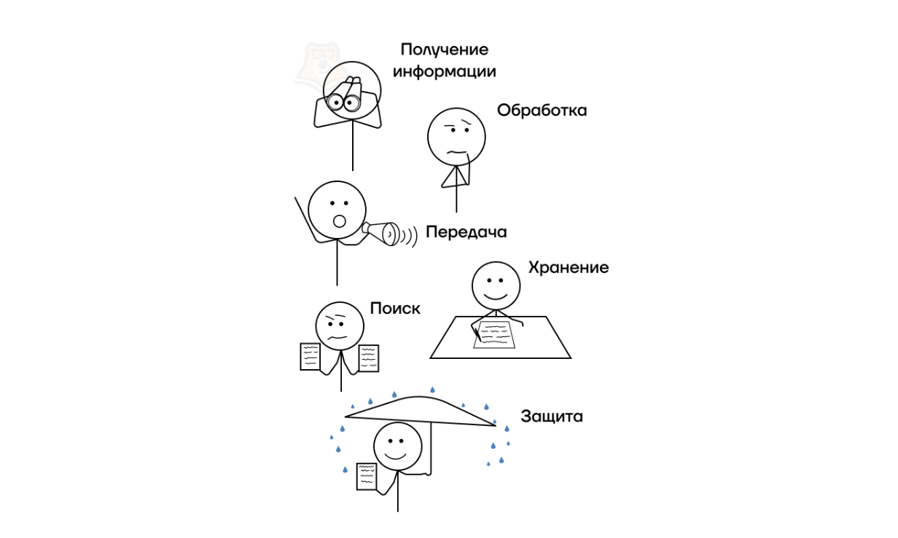

## Информация

## Докладчик

:::::::::::::: {.columns align=center}
::: {.column width="70%"}

  * Шуваев Сергей Александрович
  * студент
  * Российский университет дружбы народов
  * [1032262691@pfur.ru](mailto:1032262691@pfur.ru)
  * <https://Grinders060050.github.io/ru/>

:::
::: {.column width="25%"}

:::
::::::::::::::

## Цель

Рассмотреть понятия сигнала, данных и информации, методы получения информации и её основные свойства.

## Введение

* Информация — один из ключевых ресурсов современного общества.
* Человек и технические системы получают её не напрямую, а через сигналы и данные.
* Сигналы — физические носители сообщений.
* Данные — зарегистрированная форма сигналов.
* Информация — осмысленные сведения, уменьшающие неопределённость.

## Сигналы

* Сигнал — физический процесс, изменяющийся во времени или пространстве и несущий сообщение.
* Виды сигналов:
  * электрические, оптические, акустические, радиотехнические, механические;
  * аналоговые, дискретные, цифровые.
* Параметры: амплитуда, частота, фаза, длительность, полярность.
* Модуляция: AM, FM, PM, цифровые виды.
* Сам сигнал ещё не является информацией.

{#fig:001 width=30%}

## Данные

* Данные — зарегистрированные сигналы в формальной форме.
* Формы: текст, числа, изображения, звук, видео, таблицы, бинарные коды.
* Носители: бумага, диски, полупроводниковая память, облачные хранилища.
* Цепочка: сигнал → данные → информация → знания.

{#fig:002 width=40%}

## Пример

* Термометр воспринимает температуру как физический сигнал.
* Число на шкале — данные.
* Сообщение «в комнате 22 °C, комфортно» — информация.

## Методы получения информации

* Наблюдение * Измерение
* Эксперимент * Анализ документов и баз данных
* Опрос, анкетирование, интервью * Обработка сигналов
* Мониторинг * Сенсорные системы и IoT
* Сенсорные системы и IoT * Дистанционное зондирование

{#fig:003 width=30%}

## Классификация методов

* Прямые и косвенные
* Контактные и бесконтактные
* Активные и пассивные
* Выбор метода влияет на точность, полноту и достоверность информации.

## Свойства информации

* Объективность * Достоверность
* Полнота * Точность
* Актуальность* Ценность (полезность)

{#fig:004 width=50%}

## Свойства информации (продолжение)

* Понятность * Доступность
* Релевантность * Защищённость
* Целостность * Конфиденциальность

{#fig:005 width=50%}

## Свойства информации в информатике

* Синтаксические — форма представления.
* Семантические — смысл.
* Прагматические — полезность.

{#fig:006 width=40%}

## Заключение

* Сигналы, данные и информация образуют единую цепочку получения сведений.
* Сигналы — физическая основа.
* Данные — зарегистрированная форма.
* Информация — результат интерпретации.
* Учёт свойств информации необходим при сборе, обработке, передаче и защите данных.

## Список литературы

1. Julia 1.11 Documentation. URL: <https://docs.julialang.org/en/v1/> (дата обращения: 11.10.2024)
2. JuliaLang. URL: <https://julialang.org/> (дата обращения: 11.10.2024)