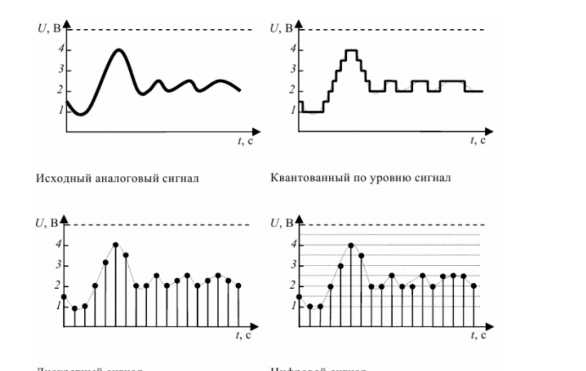

## Front matter
title: "Доклад на тему: Сигналы, данные и методы получения информации. Свойства информации"
subtitle: "Дисциплина: Источники угроз кибербезопасности"
author: "Шуваев Сергей Александрович"

## Generic otions
lang: ru-RU
toc-title: "Содержание"

## Bibliography
bibliography: bib/cite.bib
csl: pandoc/csl/gost-r-7-0-5-2008-numeric.csl

## Pdf output format
toc: true # Table of contents
toc-depth: 2
lof: true # List of figures
lot: false # List of tables
fontsize: 12pt
linestretch: 1.5
papersize: a4
documentclass: scrreprt
## I18n polyglossia
polyglossia-lang:
  name: russian
  options:
	- spelling=modern
	- babelshorthands=true
polyglossia-otherlangs:
  name: english
## I18n babel
babel-lang: russian
babel-otherlangs: english
## Fonts
mainfont: IBM Plex Serif
romanfont: IBM Plex Serif
sansfont: IBM Plex Sans
monofont: IBM Plex Mono
mathfont: STIX Two Math
mainfontoptions: Ligatures=Common,Ligatures=TeX,Scale=0.94
romanfontoptions: Ligatures=Common,Ligatures=TeX,Scale=0.94
sansfontoptions: Ligatures=Common,Ligatures=TeX,Scale=MatchLowercase,Scale=0.94
monofontoptions: Scale=MatchLowercase,Scale=0.94,FakeStretch=0.9
mathfontoptions:
## Biblatex
biblatex: true
biblio-style: "gost-numeric"
biblatexoptions:
  - parentracker=true
  - backend=biber
  - hyperref=auto
  - language=auto
  - autolang=other*
  - citestyle=gost-numeric
## Pandoc-crossref LaTeX customization
figureTitle: "Рис."
tableTitle: "Таблица"
listingTitle: "Листинг"
lofTitle: "Список иллюстраций"
lotTitle: "Список таблиц"
lolTitle: "Листинги"
## Misc options
indent: true
header-includes:
  - \usepackage{indentfirst}
  - \usepackage{float} # keep figures where there are in the text
  - \floatplacement{figure}{H} # keep figures where there are in the text
---

# Введение

Информация является одним из ключевых ресурсов современного общества. Однако человек и технические системы получают её не напрямую, а через сигналы и данные. Сигналы выступают физическими носителями сообщений, данные — зарегистрированной формой этих сигналов, а информация — осмысленными сведениями, которые уменьшают неопределённость и используются для принятия решений. В докладе рассматриваются понятия сигнала, данных, методы получения информации и её основные свойства.

# Сигналы

Сигнал — это физический процесс, изменяющийся во времени или пространстве и несущий сообщение. Сигналы могут быть электрическими, оптическими, акустическими, радиотехническими, механическими и др. Основные виды сигналов:

- аналоговые — непрерывные по времени и величине;
- дискретные — принимают отдельные значения;
- цифровые — представлены в виде последовательности кодовых символов (обычно 0 и 1).

Сигнал характеризуется такими параметрами, как амплитуда, частота, фаза, длительность, полярность. Для передачи информации применяются модуляция и манипуляция: амплитудная (AM), частотная (FM), фазовая (PM), а также различные цифровые виды модуляции.

Важно понимать: сам по себе сигнал ещё не является информацией. Он лишь переносит сообщение, которое должно быть принято, обработано и интерпретировано.

{#fig-001 width=70%}

# Данные

Данные — это зарегистрированные сигналы, представленные в формальной форме, пригодной для хранения, передачи и обработки. Данные могут быть представлены в виде текста, чисел, изображений, звука, видео, таблиц, бинарных кодов. Носителями данных служат бумага, магнитные и оптические диски, полупроводниковая память, облачные хранилища и т.д.

Различие между данными и информацией:

- данные — это «сырой» материал, результат регистрации сигналов;
- информация — это осмысленные сведения, полученные после обработки и интерпретации данных;
- знания — это информация, проверенная практикой и используемая для решения задач.

Таким образом, можно выстроить цепочку: сигнал → данные → информация → знания.

Пример: термометр воспринимает температуру как физический сигнал. Число на шкале — это данные. Сообщение «в комнате 22 °C, комфортно» — это информация.

{#fig-002 width=70%}

# Методы получения информации

Методы получения информации зависят от природы объекта и целей исследования. Основные методы:

- наблюдение — целенаправленное восприятие объекта без активного вмешательства;
- измерение — сравнение величины с эталоном для получения количественных данных;
- эксперимент — активное воздействие на объект для выявления его свойств;
- опрос, анкетирование, интервью — получение сведений от людей;
- анализ документов и баз данных — извлечение информации из уже существующих источников;
- мониторинг — длительное слежение за состоянием объекта;
- сенсорные системы и Интернет вещей (IoT) — автоматический сбор данных с датчиков;
- дистанционное зондирование — радиолокация, спутниковые снимки, тепловидение;
- обработка сигналов — фильтрация, усиление, оцифровка, спектральный анализ, распознавание образов, машинное обучение.

Методы делятся на прямые и косвенные, контактные и бесконтактные, активные и пассивные. Выбор метода влияет на точность, полноту и достоверность получаемой информации.

{#fig-003 width=70%}

# Свойства информации

Информация обладает рядом свойств, которые определяют её качество и практическую ценность:

- объективность — независимость от чьего-либо мнения;
- достоверность — соответствие реальному положению дел;
- полнота — достаточность для понимания и принятия решения;
- точность — степень близости к истинному значению;
- актуальность — своевременность поступления;
- ценность (полезность) — способность помогать в достижении цели;
- понятность — доступность для получателя по форме и языку;
- доступность — возможность получения информации;
- релевантность — соответствие запросу или задаче;
- защищённость — невозможность несанкционированного доступа, изменения или уничтожения;
- целостность — неизменность и сохранность данных;
- конфиденциальность — доступ только для уполномоченных пользователей.

В информатике также выделяют синтаксические, семантические и прагматические свойства информации. Синтаксические связаны с формой представления, семантические — со смыслом, прагматические — с полезностью.

{#fig-004 width=70%}

# Заключение

Сигналы, данные и информация образуют единую цепочку получения сведений об окружающем мире. Сигналы служат физической основой, данные — зарегистрированной формой, а информация — результатом интерпретации. Методы получения информации определяют её качество: наблюдение, измерение, эксперимент, мониторинг и автоматизированные сенсорные системы. Важнейшими свойствами информации являются объективность, достоверность, полнота, точность, актуальность, ценность, понятность и защищённость. Учёт этих свойств необходим при сборе, обработке, передаче и защите информации в современных системах связи и управления.

# Список литературы{.unnumbered}

::: {#refs}
:::