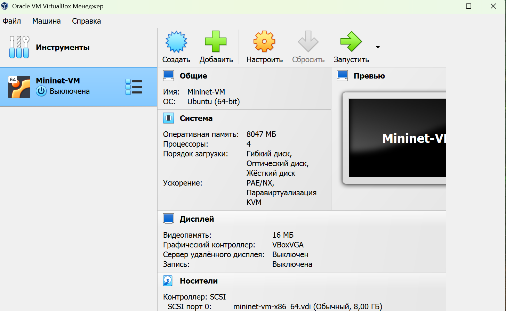

---
## Front matter
lang: ru-RU
title: Лабораторная работа №1
subtitle: Шифры простой замены
author:
  -  Шуваев С. А.
institute:
  - Российский университет дружбы народов, Москва, Россия

## i18n babel
babel-lang: russian
babel-otherlangs: english

## Formatting pdf
toc: false
toc-title: Содержание
slide_level: 2
aspectratio: 169
section-titles: true
theme: metropolis
header-includes:
 - \metroset{progressbar=frametitle,sectionpage=progressbar,numbering=fraction}
---

# Информация

## Докладчик

:::::::::::::: {.columns align=center}
::: {.column width="70%"}

  * Шуваев Сергей Александрович
  * студент
  * Российский университет дружбы народов
  * [1032262691@pfur.ru](mailto:1032262691@pfur.ru)
  * <https://Grinders060050.github.io/ru/>

:::
::: {.column width="25%"}


:::
::::::::::::::

## Цель работы

**Цель:** изучить и реализовать шифры простой замены через графический интерфейс.

##  Шифр Цезаря

```Julia
function ceaser(word::String, k::Int)
    result = IOBuffer()
    for c in word
        if 'a' <= c <= 'z'
            shifted = (Int(c) - Int('a') + k)%26 + Int('a')
            print(result, Char(shifted))
        elseif 'A' <= c <= 'Z'
            shifted = (Int(c) - Int('A') + k)%26 + Int('A')
            print(result, Char(shifted))
        else
            print(result, c)
        end
    end
    return String(take!(result))
end
```

##  Шифр Цезаря

```Julia
print("Enter key: ")
k = parse(Int, readline())
print("Enter word: ")
word = readline()
println(ceaser(word,k))
```

##  Шифр Цезаря

{#fig:001 width=70%}

# Шифр Атбаш

```Julia
function atbash(word::String)
    return join(Char(
            if 'a' <= c <= 'z'
                (Int('z') - (Int(c) - Int('a'))) 
            elseif 'A' <= c <= 'Z'
                (Int('Z') - (Int(c) - Int('A')))
            else
                Int(c)
            end
    ) for c in word)
end
print("Enter your word: ")
word = readline()
println(atbash(word))
```


# Шифр Атбаш

{#fig:002 width=70%}


## Выводы

В результате выполнения данной лабораторной работы были изучены и реализованы шифры простой замены (шифр Цезаря и шифр Атбаш).кий интерфейс.

## Список литературы

1. Julia1.11Documentation. url: https://docs.julialang.org/en/v1/ (дата обр. 11.10.2024)

2. JuliaLang. url: https://julialang.org/ (дата обр. 11.10.2024)
