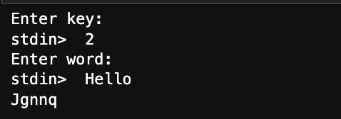

---
## Front matter
title: "Лабораторная работа №1"
subtitle: "Шифры простой замены"
author: "Шуваев Сергей Александрович"

## Generic otions
lang: ru-RU
toc-title: "Содержание"

## Bibliography
bibliography: bib/cite.bib
csl: pandoc/csl/gost-r-7-0-5-2008-numeric.csl

## Pdf output format
toc: true # Table of contents
toc-depth: 2
lof: true # List of figures
lot: false # List of tables
fontsize: 12pt
linestretch: 1.5
papersize: a4
documentclass: scrreprt
## I18n polyglossia
polyglossia-lang:
  name: russian
  options:
	- spelling=modern
	- babelshorthands=true
polyglossia-otherlangs:
  name: english
## I18n babel
babel-lang: russian
babel-otherlangs: english
## Fonts
mainfont: IBM Plex Serif
romanfont: IBM Plex Serif
sansfont: IBM Plex Sans
monofont: IBM Plex Mono
mathfont: STIX Two Math
mainfontoptions: Ligatures=Common,Ligatures=TeX,Scale=0.94
romanfontoptions: Ligatures=Common,Ligatures=TeX,Scale=0.94
sansfontoptions: Ligatures=Common,Ligatures=TeX,Scale=MatchLowercase,Scale=0.94
monofontoptions: Scale=MatchLowercase,Scale=0.94,FakeStretch=0.9
mathfontoptions:
## Biblatex
biblatex: true
biblio-style: "gost-numeric"
biblatexoptions:
  - parentracker=true
  - backend=biber
  - hyperref=auto
  - language=auto
  - autolang=other*
  - citestyle=gost-numeric
## Pandoc-crossref LaTeX customization
figureTitle: "Рис."
tableTitle: "Таблица"
listingTitle: "Листинг"
lofTitle: "Список иллюстраций"
lotTitle: "Список таблиц"
lolTitle: "Листинги"
## Misc options
indent: true
header-includes:
  - \usepackage{indentfirst}
  - \usepackage{float} # keep figures where there are in the text
  - \floatplacement{figure}{H} # keep figures where there are in the text
---

# Цель работы

Изучить и реализовать шифры простой замены.
Реализовать с помощью языка программирования Julia:

- Шифр Цезаря
- Шифр Атбаш

# Теоретическое введение

Реализовать с помощью языка программирования Julia:

- Шифр Цезаря
- Шифр Атбаш

# Выполнение лабораторной работы

Julia -- высокоуровневый свободный язык программирования с динамической типизацией, созданный для математических вычислений [@julialang]. Эффективен также и для написания программ общего назначения. Синтаксис языка схож с синтаксисом других математических языков, однако имеет некоторые существенные отличия.

Для выполнения заданий была использована официальная документация Julia [@juliadoc].

# Выполнение лабораторной работы

Шифр Цезаря ( также он является шифром простой замены ) -- это моноалфавитная подстановка, т.е. каждой букве открытого текста ставится в соответствие одна буква шифртекста.
При реализации функции шифра Цезаря на вход будет поступать слово для шифрования в виде строки и ключ в виде числа, на которое мы смещаем алфавит.

```Julia
function ceaser(word::String, k::Int)
    result = IOBuffer()
    for c in word
        if 'a' <= c <= 'z'
            shifted = (Int(c) - Int('a') + k)%26 + Int('a')
            print(result, Char(shifted))
        elseif 'A' <= c <= 'Z'
            shifted = (Int(c) - Int('A') + k)%26 + Int('A')
            print(result, Char(shifted))
        else
            print(result, c)
        end
    end
    return String(take!(result))
end
print("Enter key: ")
k = parse(Int, readline())
print("Enter word: ")
word = readline()
println(ceaser(word,k))
```

После отработки программы получаем результат ([рис. @fig-001]).

{#fig-001 width=70%}

Шифр Атбаш является шифром сдвига на всю длину алфавита.
Поэтому реализация будет выглядеть следующим образом:

```Julia
function atbash(word::String)
    return join(Char(
            if 'a' <= c <= 'z'
                (Int('z') - (Int(c) - Int('a'))) 
            elseif 'A' <= c <= 'Z'
                (Int('Z') - (Int(c) - Int('A')))
            else
                Int(c)
            end
    ) for c in word)
end
print("Enter your word: ")
word = readline()
println(atbash(word))
```
После отработки программы получаем результат ([рис. @fig-002]).

{#fig-002 width=70%}


# Выводы

В результате выполнения данной лабораторной работы были изучены и реализованы шифры простой замены (шифр Цезаря и шифр Атбаш).

# Список литературы{.unnumbered}

::: {#refs}
:::
